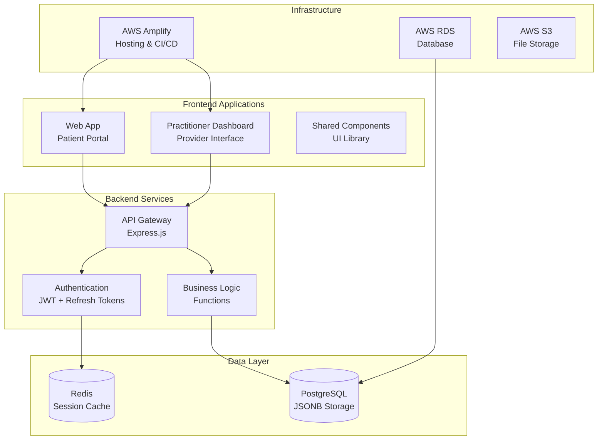

# System Architecture

## Overview

The Health Platform is built as a modern, scalable web application with clear separation between frontend applications and backend services, utilizing JSONB for flexible data storage and a security-first approach.

## High-Level Architecture



## Project Structure

```
health-platform/
├── frontend/
│   ├── web-app/           # Main user-facing application
│   ├── practioner-dashboard/ # Healthcare provider interface
│   └── shared/            # Shared components and utilities
├── backend/
│   ├── functions/         # API endpoints and business logic
│   ├── database/          # Schema, migrations, and queries
│   └── scripts/           # Utility and maintenance scripts
├── docs/                  # Project documentation
├── dev-notes/             # Development notes (gitignored)
└── scripts/               # Build and deployment scripts
```

## Technology Stack

### Frontend Architecture
- **Framework:** React 19.1.0
- **Build Tool:** Vite
- **Styling:** Tailwind CSS
- **Icons:** Lucide React
- **State Management:** React hooks and context

### Component Architecture

#### Shared Component Library
- **Alert:** Displays notification and alert messages with customizable variants and dismissal options
- **Button:** Interactive button component with loading states, variants, and icon support
- **Card:** Container component with optional title, subtitle, icon, and content sections
- **Input:** Form input component with focus colors, validation, and styling options
- **Select:** Dropdown selection component with customizable styling and focus colors
- **Textarea:** Multi-line text input with configurable rows and styling options

#### Application Components  
- **Total Components:** 19
- **Shared Components:** 6
- **App-Specific Components:** 13


### Data Management

#### Custom Hooks
- **useDetoxTypes:** Custom React hook: useDetoxTypes
- **useExposureTypes:** Custom React hook: useExposureTypes
- **useProtocols:** Custom React hook: useProtocols
- **useUserPreferences:** Custom React hook: useUserPreferences
- **useSetupWizard:** Custom React hook: useSetupWizard
- **useReflectionData:** Custom React hook: useReflectionData


## Backend Architecture

### AWS Infrastructure

- **API Gateway:** REST API endpoints
- **Base URL:** `https://suhoxvn8ik.execute-api.us-east-1.amazonaws.com/dev`
- **Lambda Functions:** Serverless compute
- **Working Endpoints:** 4
- **Protected Endpoints:** 5


### Database Design
- **Primary Database:** PostgreSQL 14+ with JSONB support
- **Modern Schema:** JSONB-first approach for health data
- **Indexing:** GIN indexes for fast JSONB queries
- **Backup:** Automated backups with point-in-time recovery

### JSONB Data Architecture

#### **journal_entries Table:**
```sql
CREATE TABLE journal_entries (
    id UUID PRIMARY KEY DEFAULT uuid_generate_v4(),
    user_id UUID REFERENCES users(id),
    entry_date DATE NOT NULL,
    reflection_data JSONB DEFAULT '{}',
    consent_to_anonymize BOOLEAN DEFAULT false,
    created_at TIMESTAMP DEFAULT now(),
    updated_at TIMESTAMP DEFAULT now()
);
```

#### **timeline_entries Table:**
```sql
CREATE TABLE timeline_entries (
    id UUID PRIMARY KEY DEFAULT uuid_generate_v4(),
    journal_entry_id UUID REFERENCES journal_entries(id),
    user_id UUID REFERENCES users(id),
    entry_time TIME NOT NULL,
    entry_type VARCHAR(50) NOT NULL,
    entry_date DATE NOT NULL DEFAULT CURRENT_DATE,
    structured_content JSONB,
    created_at TIMESTAMP DEFAULT now()
);
```

## Data Flow Architecture

### Request Flow
1. **Frontend** makes API calls via custom hooks
2. **API Gateway** routes requests to appropriate Lambda functions  
3. **Lambda Functions** process business logic and database operations
4. **PostgreSQL** stores all application data
5. **Response** returns through the same chain

### State Management
- **Local State:** React useState/useReducer for component state
- **Global State:** Context providers for shared data
- **Server State:** Custom hooks for API data fetching and caching
- **Form State:** Controlled components with validation

## Deployment Architecture

### Current Deployment
- **Frontend Hosting:** AWS Amplify
- **Backend API:** AWS Lambda + API Gateway  
- **Database:** AWS RDS PostgreSQL
- **Documentation:** GitHub Pages

### CI/CD Pipeline
1. **Code Push** → GitHub repository
2. **GitHub Actions** → Automated testing and building
3. **AWS Amplify** → Frontend deployment
4. **Documentation** → Auto-generated and deployed

## Security Architecture

### Current Implementation
- **HTTPS:** All traffic encrypted in transit
- **CORS:** Configured for secure cross-origin requests
- **API Protection:** 5 endpoints require authentication

### Production Security Plan
- **Authentication:** JWT tokens with refresh mechanism
- **Authorization:** Role-based access control (Patient/Practitioner)  
- **Data Encryption:** Encryption at rest for sensitive data
- **API Security:** Rate limiting, input validation, API keys

## Scalability Considerations

### Horizontal Scaling
- **Lambda Functions:** Auto-scaling based on demand
- **Database:** Read replicas for query scaling
- **CDN:** Global CloudFront distribution for static assets

### Performance Optimization
- **Bundle Splitting:** Dynamic imports for code splitting
- **API Caching:** Response caching with appropriate TTL
- **Database Optimization:** Indexed queries and connection pooling
- **Image Optimization:** WebP format and responsive images

## Development Workflow

### Monorepo Benefits
- **Shared Components:** Reusable across all applications
- **Consistent Tooling:** Same build tools and configurations
- **Atomic Changes:** Update multiple apps in single commit
- **Code Sharing:** Utilities and types shared across projects

### Quality Assurance
- **Automated Analysis:** Codebase analysis on every commit
- **Documentation:** Auto-generated and always up-to-date
- **Type Safety:** TypeScript integration (planned)
- **Testing:** Unit and integration testing (planned)

---

*This architecture documentation is automatically generated from codebase analysis.*
